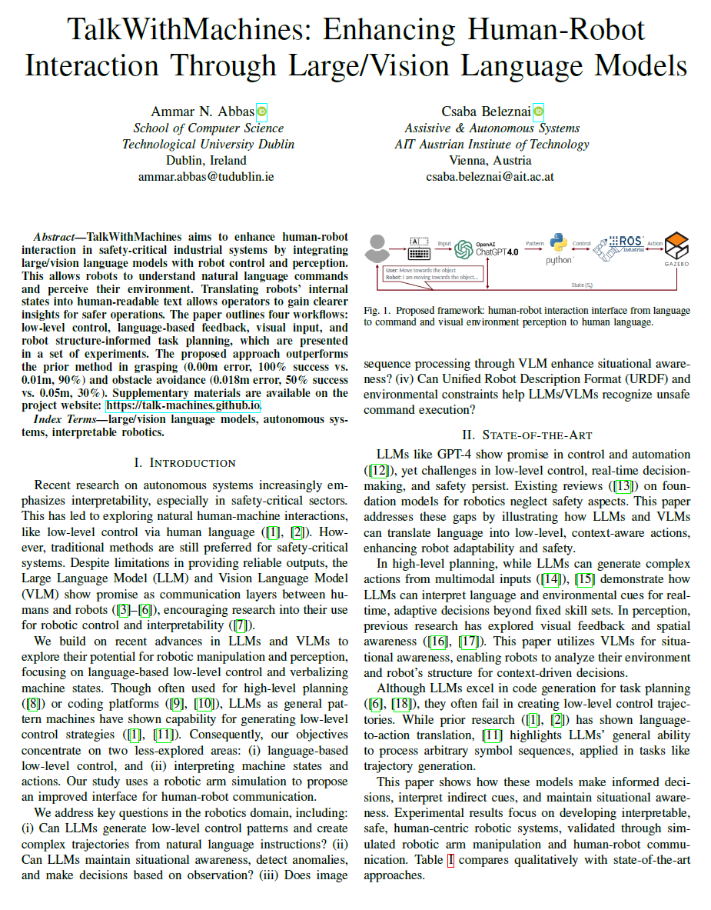
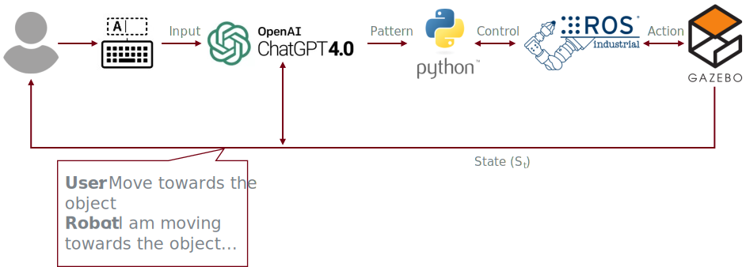
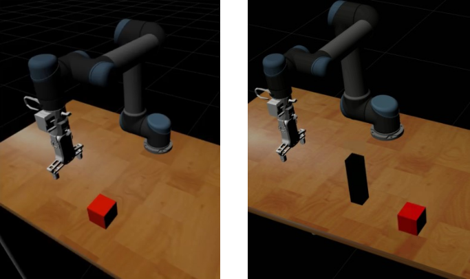
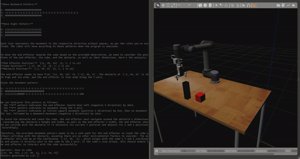
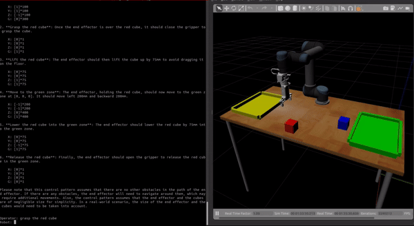
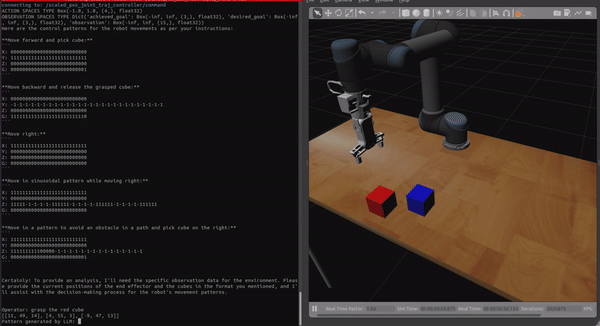

<p align="center">
  <h1>TalkMachines</h1>
</p>

<!-- Top links as icons with Cite Us badge -->
<p align="center">
  <a href="https://talk-machines.github.io/" title="Project Website">
    
  </a>
  <a href="https://arxiv.org/abs/2412.15462" title="ArXiv Preprint">
    
  </a>
</p>

<!-- Main images at the top -->
<p align="center">
  
</p>
<p align="center">
  
</p>

TalkMachines is a modular robotics framework combining advanced control and perception capabilities with verbal interaction, enabling robots to understand and execute complex commands in dynamic environments.

---

## Structure

### Control + Perception
This module executes commands based on input received and is subdivided into:

- **say_move**  
  - **say_move**: Utilizes the OpenAI API for general command execution.  
  - **say_move_copilot**: Uses the Sydney Copilot API for specialized command handling.  
  - **say_move_copilot_v2**: An enhanced version of the Sydney Copilot API integration.

### Perception (Visual + Sensor Data)
This module processes visual and sensor data to understand the environment and inform decision-making.

- **verbal_states**  
  - **say_move_copilot_verbal_states**: Integrates verbal state data with the Sydney Copilot API.

---

## Features
- **Multimodal integration**: Combines visual, sensor, and verbal input for robust situational awareness.  
- **Dynamic decision-making**: Supports adaptive command execution based on environmental understanding.  
- **Human-robot collaboration**: Enables intuitive interaction using natural language commands.  
- **Obstacle avoidance**: Real-time perception ensures safe navigation in cluttered environments.  

---

## Visual Demos

<p align="center">
  
  
</p>

<p align="center">
  
</p>

<p align="center">
  <video src="assets/obstacle_avoidance.mp4" controls width="600">
    Your browser does not support the video tag.
  </video>
</p>

---

## Resources
- **Website**: [TalkMachines](https://talk-machines.github.io/)  
- **IEEE Paper**: [IEEE Xplore](https://ieeexplore.ieee.org/document/10817940)  
- **ArXiv Preprint**: [arXiv:2412.15462](https://arxiv.org/abs/2412.15462)
- **Supplementary Materials**: `[Appendix](https://github.com/talk-machines/talk_machines/blob/main/assets/appendix.pdf)`  
---

## Further Details
- Modular framework enabling **separate updates to control and perception modules**.  
- **Language model integration** for verbal commands and human-robot collaboration.  
- Perception includes **object recognition, motion planning, and verbal state awareness**.  
- Works in **dynamic environments** with real-time sensor feedback.  
- Designed for **research, education, and prototyping** of robotics tasks.

---

## Citation

If you use TalkMachines in your work, please cite:

**APA:**

```

Abbas, A. N., & Beleznai, C. (2024, December). Talkwithmachines: Enhancing human-robot interaction through large/vision language models. In 2024 Eighth IEEE International Conference on Robotic Computing (IRC) (pp. 253-258). IEEE.

````

**BibTeX:**

```bibtex
@inproceedings{abbas2024talkwithmachines,
  title={Talkwithmachines: Enhancing human-robot interaction through large/vision language models},
  author={Abbas, A. N. and Beleznai, C.},
  booktitle={2024 Eighth IEEE International Conference on Robotic Computing (IRC)},
  pages={253--258},
  year={2024},
  organization={IEEE}
}
````
